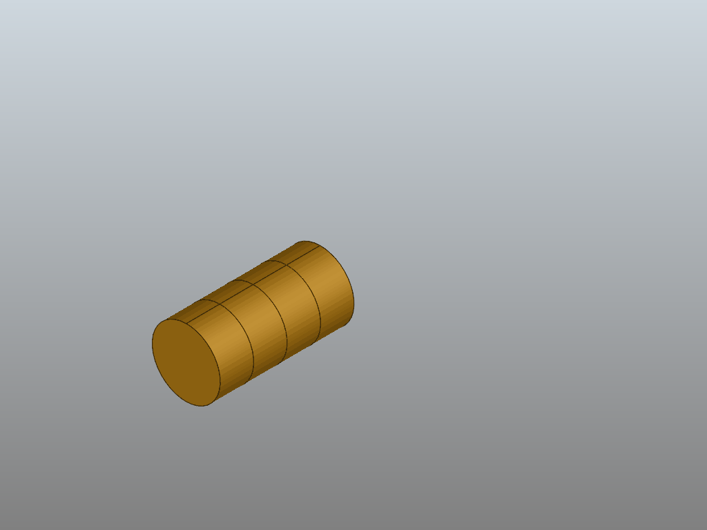

# CPACSCreator Animation



This example demonstrates 

 - how to generate an airplane from scratch
 - how to smoothly modify CPACS parameters
 - how to create an animation from a sequence of CPACS configurations
 
## Usage
 
As of November 2019, the CPACSCreator is still in a pre-release stage and not part of TiGL. To run this example, create 
a fresh conda environment and install cpacscreator from the `dlr-sc` channel, as well as some dependencies:
 
```bash
conda create -n cpacscreator python=3.6 cpacscreator numpy imageio -c dlr-sc
conda activate cpacscreator
```

Run the example:

```bash
python create_airplane.py
```